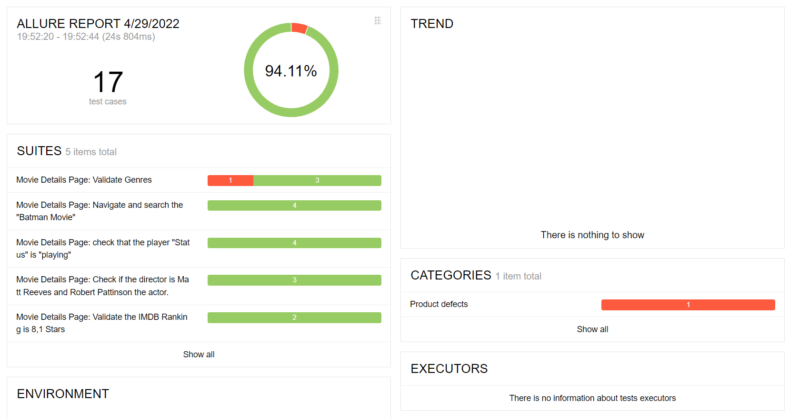
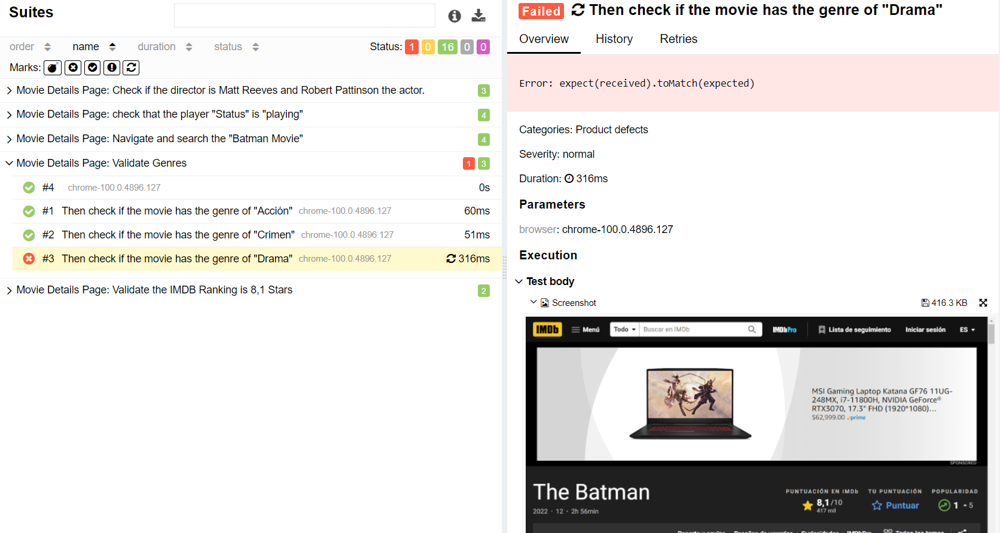

# E2E-Testing-Framework TEAM 1

- Francisco Elisea
- Luis Barrón
- Joel Solano
- Marcelo Sala
- Renata Hurtado

To run the reports run in the console:

````
```
cd cucumber
npm install
npm run wdio
allure generate allure-results --clean -o allure-report && allure open
```
````

## Evidence from screenshots in fail:

<p align="center" width="100%">
   
   
</p>
